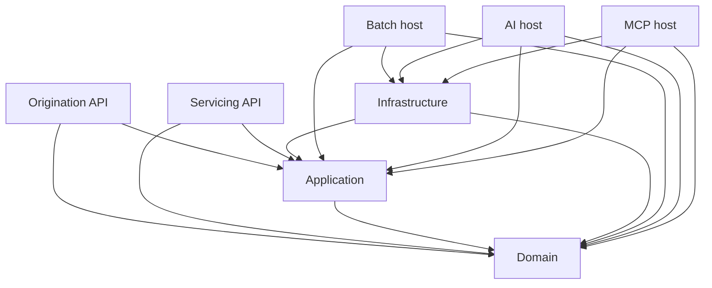

# Current solution structure

Reviewed against the working tree on 2026-09-16. Consult [delivery status](../status.md) for the latest tested scope.

The solution contains eight source projects, six test projects and two benchmark projects. Projects are organized by architectural layer; origination, servicing, risk and AI are conceptual boundaries, not independently implemented services.

| Project | Kind | Current responsibility |
|---|---|---|
| Promissio.Domain | Library | Value objects, day counts, interest, schedules, dated APRC, loan lifecycle and event replay |
| Promissio.Application | Library | MediatR creation workflow and loan persistence port; other workflows remain scaffolding |
| Promissio.Infrastructure | Library | Marten loan repository, atomic handoff idempotency receipt and NodaTime persistence configuration; no projections or EF Core model |
| Promissio.Api.Origination | Web host | Empty HTTP application; no business routes or Scalar UI |
| Promissio.Api.Servicing | Web host | Empty HTTP application; no business routes or Scalar UI |
| Promissio.BatchProcessor | Generic host executable | Starts and stops a host; no scheduled jobs or financial batch work |
| Promissio.AI | Web host | Reserved agent runtime; development OpenAPI only, no agents |
| Promissio.AI.McpServer | Web host | Reserved MCP boundary; no MCP transport, tools or authorization wired |

## Project references today

Arrows below mean compile-time references, not network calls.

Infrastructure references Application to implement its loan persistence port and reaches Domain transitively through that contract. APIs do not yet compose Infrastructure. Domain references NodaTime only, and Application has no dependency on persistence or transports.

## Runtime and tests

Docker Compose defines PostgreSQL, Qdrant and Jaeger dependencies; it does not launch the application hosts or Langfuse. Domain, Application and Infrastructure unit verification require no database. The Integration suite requires a working Docker endpoint for its PostgreSQL Testcontainer. AI evaluations remain a placeholder, not coverage.

The infrastructure test verifies repository registration. Application tests cover creation orchestration. Real PostgreSQL Testcontainers scenarios cover creation, replay and handoff idempotency in source, but their current execution is pending a Docker-capable host. Endpoint behavior, batch idempotency and AI evaluations remain future work.

Both benchmark projects are in the solution so their API drift becomes a build failure. Their scopes and commands are documented in [benchmarks](../../benchmarks/README.md).
