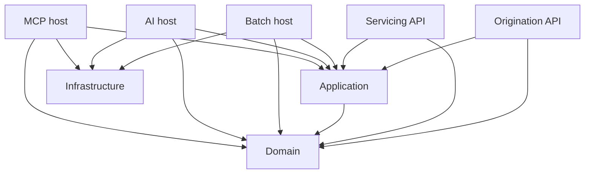

# Current solution structure

Reviewed against the working tree on 2026-09-10. Consult [verification evidence](../verification/2026-09-10-structure-alignment.md) for tested scope.

The solution contains eight source projects, six test projects and two benchmark projects. Projects are organized by architectural layer; origination, servicing, risk and AI are conceptual boundaries, not independently implemented services.

| Project | Kind | Current responsibility |
|---|---|---|
| Promissio.Domain | Library | Value objects, day counts, interest, schedules and dated APRC |
| Promissio.Application | Library | MediatR registration and validation scaffolding; no loan workflows |
| Promissio.Infrastructure | Library | Marten registration scaffold; no repositories, event streams or EF Core model |
| Promissio.Api.Origination | Web host | Empty HTTP application; no business routes or Scalar UI |
| Promissio.Api.Servicing | Web host | Empty HTTP application; no business routes or Scalar UI |
| Promissio.BatchProcessor | Generic host executable | Starts and stops a host; no scheduled jobs or financial batch work |
| Promissio.AI | Web host | Reserved agent runtime; development OpenAPI only, no agents |
| Promissio.AI.McpServer | Web host | Reserved MCP boundary; no MCP transport, tools or authorization wired |

## Project references today

Arrows below mean compile-time references, not network calls.

Infrastructure currently has no project references because it has no application-port implementations. APIs do not yet compose Infrastructure. These are missing implementation links, not completed workflows. Domain references NodaTime only, and Application has no dependency on persistence or transports.

## Runtime and tests

Docker Compose defines PostgreSQL, Qdrant and Jaeger dependencies; it does not launch the application hosts or Langfuse. Domain verification requires no database. Empty Application, Integration and AI evaluation projects are reported as placeholders, not coverage.

The infrastructure test is a registration smoke test. Batch tests exercise host registration and lifecycle only. Real PostgreSQL persistence, endpoint behavior, batch idempotency and AI evaluations remain future work.

Both benchmark projects are in the solution so their API drift becomes a build failure. Their scopes and commands are documented in [benchmarks](../../benchmarks/README.md).
